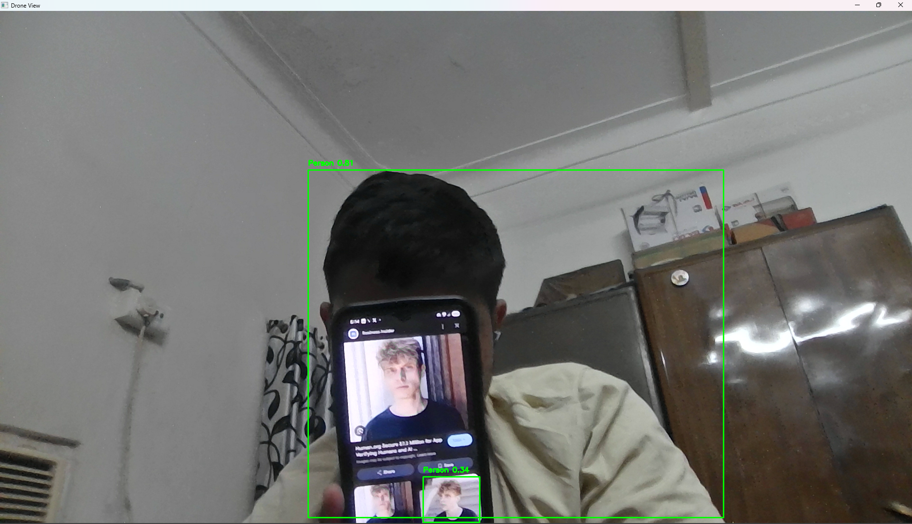

# 👁️ Human & Person Detection System

A clean, light-weight, and high-performance **Human Detection and Tracking System** written in Python. This repository provides three different detection pipelines using advanced Deep Learning models (**YOLOv8** and **MobileNet-SSD** via OpenCV's DNN module) for both static images and live webcam streams.

---

## 🚀 Key Features

*   **⚡ Multi-Model Architecture**: Run detections using either ultra-fast YOLOv8 or optimized MobileNet-SSD.
*   **📷 Image Detection (`src/human1.py`)**: Detects people in static images with automatic fallbacks and robust error handling.
*   **🎥 Real-Time Webcam YOLOv8 (`src/human2.py`)**: Leverage the state-of-the-art YOLOv8 Nano model for real-time person tracking.
*   **💻 Real-Time Webcam MobileNet-SSD (`src/human3.py`)**: Optimized Caffe model for running on low-resource hardware like Raspberry Pi.
*   **🛠️ Zero Setup Overhead**: Built-in pre-trained model files for immediate, out-of-the-box execution.

---

## 📁 Repository Structure

```bash
human/
│
├── src/                                 # Source code folder
│   ├── human1.py                        # Static image detection script
│   ├── human2.py                        # Live webcam detection (YOLOv8)
│   └── human3.py                        # Live webcam detection (MobileNet-SSD)
│
├── models/                              # Pre-trained Deep Learning models
│   ├── MobileNetSSD_deploy.caffemodel   # Pre-trained MobileNet-SSD weights
│   ├── MobileNetSSD_deploy.prototxt.txt # MobileNet-SSD network configuration
│   └── yolov8n.pt                       # Pre-trained YOLOv8 Nano weights
│
├── images/                              # Images folder
│   └── match.jpg                        # Sample target image for static detection
│
├── .gitignore                           # Python and IDE git ignore settings
├── requirements.txt                     # Package dependencies
└── README.md                            # Project documentation
```
## 🧪 Testing Code

<!-- Simple -->


---

## 🛠️ Installation & Setup

1. **Clone this repository** (or download it to your machine):
   ```bash
   git clone https://github.com/YOUR_USERNAME/human-detection.git
   cd human-detection
   ```

2. **Install the dependencies**:
   Make sure you have Python installed, then run:
   ```bash
   pip install -r requirements.txt
   ```

---

## 🏃 How to Run

### 1. Static Image Detection (`src/human1.py`)
This script loads an image from the `images/` directory, runs it through the MobileNet-SSD network, identifies any humans present, and displays the image with bounding boxes.

*   **Run command**:
    ```bash
    python src/human1.py
    ```
*   *Note: If `images/match.jpg` is missing, the script will automatically look for and fall back to any other image found in the `images/` folder or the project root.*

### 2. Live Webcam Detection using YOLOv8 (`src/src/human2.py`)
Leverages YOLOv8's state-of-the-art person detection, highly optimized for speed and accuracy.

*   **Run command**:
    ```bash
    python src/human2.py
    ```
*   *Press `q` on your keyboard to exit the live feed window.*

### 3. Live Webcam Detection using MobileNet-SSD (`src/human3.py`)
Uses the OpenCV Deep Neural Network (DNN) module and MobileNet-SSD, optimized for smooth real-time detection on low-compute platforms.

*   **Run command**:
    ```bash
    python src/human3.py
    ```
*   *Press `q` on your keyboard to exit the live feed window.*

---

## 📊 Models Summary

| Model | Type | Best For | Speed | Accuracy |
|---|---|---|---|---|
| **YOLOv8 Nano** (`models/yolov8n.pt`) | PyTorch/Ultralytics | State-of-the-art object tracking | Fast | Excellent |
| **MobileNet-SSD** (`models/MobileNetSSD_deploy.caffemodel`) | Caffe/OpenCV DNN | Low-compute / IoT devices | Extremely Fast | Good |

---

## 🤝 Contributing

Contributions, issues, and feature requests are welcome! Feel free to check the [issues page](https://github.com/YOUR_USERNAME/human-detection/issues) if you want to contribute.

---

## 📄 License

This project is open-source and available under the [MIT License](LICENSE).
